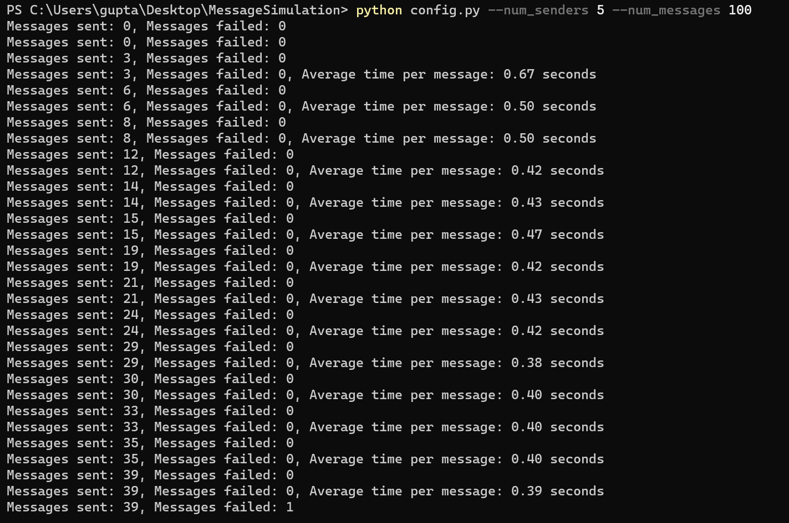
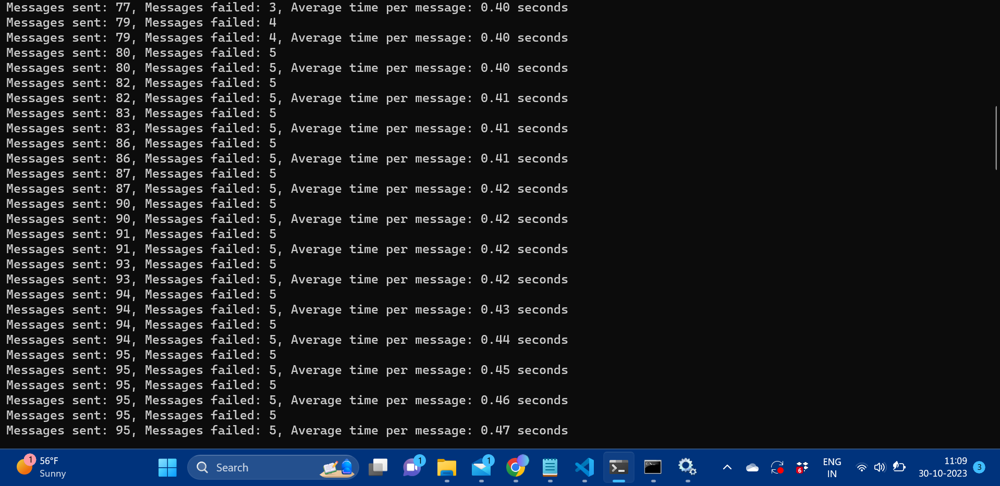
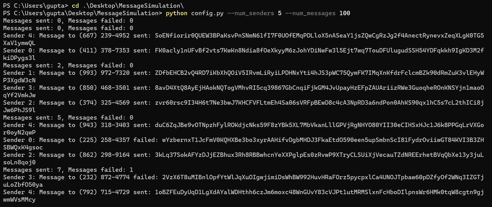

# SMS Message Queue System

This Python-based system demonstrates the use of RabbitMQ for handling SMS message queues, with multi-threading to simulate multiple message sender instances.

## Overview

The system is composed of three main parts:

1. **Producer**: Generates random SMS messages along with phone numbers and enqueues them into RabbitMQ.
2. **Sender**: Multiple sender instances, which can be run concurrently, dequeuing messages and simulating the message sending process.
3. **Progress Monitor**: Monitors the progress of message sending, reporting on both successful and failed attempts.

## Prerequisites

- Python 3.6 or higher
- RabbitMQ server
- Pika Python library

## Getting Started

### Installation

First, make sure RabbitMQ is installed on your system. You can download it from the [official RabbitMQ website](https://www.rabbitmq.com/download.html).

Once RabbitMQ is installed and running, install the required Python packages:

````sh
pip install pika
````

## Running the Application

1. Clone this repository or download the source code.
2. Open a terminal or command prompt.
3. Navigate to the project directory.
4. Execute the `main.py` script with optional arguments for configuration:
   ```sh
   python main.py --num_senders 5 --num_messages 1000


The application can be configured using the following command-line arguments:

--num_senders: Number of sender instances (default is 1).
--num_messages: Number of SMS messages to generate (default is 1000).

## Monitoring
To monitor the RabbitMQ server and the message queue, you can use the RabbitMQ Management Plugin. By default, it can be accessed at http://localhost:15672/. The default login is "guest" for both the username and password.

Navigate to the "Queues" section to see details about the message queues, including the number of enqueued messages.


## Output

Here is a screenshot of my project:






